# DESIGN v2.1 — The Paper Walkthrough

**What this is:** the single build charter for the human-in-the-loop system that turns a
meaning-correct but machine-written paper (markdown) into a paper a human wants to read,
in the author's own voice, without corrupting its content. **The product is generic:**
it works on any templated long-form paper (dissertation, thesis, proposal, journal
article), for any author who supplies the §3 inputs. The motivating case and first
acceptance test — not a build prerequisite — is `Problem Files/Dissertation Proposal
007.docx` ("Paper 007"): 73k words whose content survived review but whose prose,
grounding, and structure were flagged as machine-written by an independent human
reviewer. Its assets come in when the product is ready to run end to end.

**Status:** v2 was the revision after the adversarial review (red team + blue team +
adjudication, 2026-08-31); **v2.1 folds in the four completed research spikes R1–R4**
(§12) — the measured corrections include arc size (3–5, time-bounded), the typed hedge
diff, the mechanics lock, the 2-AFC voice calibration, and the meld's measured ceiling.
The full review record, including every attack, the alternative interaction
models considered, and the reasons each amendment was accepted or overruled, is
[reviews/2026-08-31-design-v1-red-blue-review.md](reviews/2026-08-31-design-v1-red-blue-review.md).
Everything here remains constrained by the measured findings in
[research/00-SYNTHESIS.md](research/00-SYNTHESIS.md). Where this document and a research
finding disagree, the research wins until an experiment says otherwise.

---

## 1. The problem, precisely

A paper of this class is **not wrong — it is written for the wrong reader.** The
information is correct and complete *in the author's head and sources*, but the draft:

1. **Drops concepts.** The AI can restate a section's meaning well when asked, yet the
   prose is missing jargon terms and whole concepts that must be there — some dropped
   from the sources, some never supplied by the author in the first place.
2. **Sounds machine-written at the paragraph level.** Em-dash appositives, enumerative
   templates ("The first is… The second is…"), self-narration, hedged qualifiers.
3. **Is flat at the document level.** The same few argument moves restamped
   (measured: 3.4% unique arguments LLM vs 65.3% human).
4. **Carries unverifiable grounding.** Citations pointing at private artifacts
   (e.g. "Kelley markdown line 6316"), paste artifacts, quotes of nothing.

Defect 1 is a *content* problem only the author can fix. Defects 2–4 are *rendering*
problems the system can fix — but only after 1 is fixed, and only without reintroducing 1.

## 2. Non-negotiable principles

- **P-1 Meaning-lock.** Every generation and every retry starts from the verified
  meaning skeleton + grounded sources — never from editing a previous draft. Editing
  draft N into draft N+1 compounds certainty inflation (37–75%) and content regression
  (16–27%). Regenerating from the locked skeleton resets both, and makes machine work
  idempotent (a crashed tock is replayed, not repaired).
- **P-2 Grounding before prose.** Citation verification is a blocking gate that closes
  before any sentence is styled. Staleness/unverifiability is the committee-fatal
  defect, not style. **Any amendment to a skeleton reopens grounding for the amended
  items** — a claim added at review time never ships ungrounded.
- **P-3 The human is the judge.** No self-judging loops. The author's verification of
  meaning and the author's approval of a section are the only gates that close.
  Automated scores are *diagnostics that order candidates*, never verdicts. Approved
  text is modified only through an author-accepted diff.
- **P-4 Detectors are diagnostics, not targets.** Detector and authorship scores rank
  candidates and inform anchor selection. They never gate, never route the human, and
  never appear as a target to optimize. The goal function is "reads like the author,
  reads well" — never "evades detection."
- **P-5 Markdown end to end.** The paper, the sources, and the template all live as
  markdown. `.docx` conversion is a separate downstream project, out of scope here.
  Locators recorded at grounding must be resolvable by a committee reader (page/section
  of the published source), not positions in a private markdown conversion.
- **P-6 Paragraph polish ≠ structure repair.** The melding pass (§6) fixes how a
  paragraph sounds. It cannot and must not be asked to fix document structure — that is
  the walkthrough's job, with the human, at arc and paper scope.
- **P-7 Sessions are bounded; state lives in files.** GSD-style. Every gate's output is
  committed to disk when it happens (never at end of sitting), so any sitting can end
  anywhere without loss. Gates are **append-only records, not locks**: reopening a gate
  mints a new version and logs the revocation; it never erases history.

## 3. Inputs (the contract) — Gate G0

A paper enters the walkthrough only when all four exist:

1. **Template** — the required structural spine for **every** paper, whatever its kind:
   the governing section-by-section structure (strict order), as markdown with
   per-section requirements, including each section's **type** (argumentative /
   procedural / administrative). The template is the anti-drift anchor — the arc map,
   the per-section requirements at G2, the light-path routing, and the G7 compliance
   check all hang off it, so the walkthrough can never wander from what the paper's
   institution demands. Paper 007's CTU dissertation template is one instance; a
   journal's author guidelines or a thesis handbook are others. A paper without a
   governing template gets one written at intake (from its own table of contents plus
   the venue's requirements) before anything else happens.
2. **Paper markdown** — the original markdown the paper was drafted in (not a docx
   export).
3. **Sources as markdown** — every cited work converted to markdown, so source
   cross-checks are text-to-text, each carrying a mapping back to committee-verifiable
   locators (page/section numbers of the published source).
4. **Author style corpus** — the author's writing, as markdown, segmented into candidate
   anchor paragraphs (§6). Spoken transcripts of the author explaining the paper's
   content are prime anchor material. Recorded at intake: corpus word count and document
   count, checked against the research floor for voice measurement (≥50k words, ≥40
   docs) — below the floor, voice metrics run as uncalibrated diagnostics only and the
   design's honest promise is "clean, not yet the author."

Missing input = the walkthrough does not start.

## 4. The interaction model — arc-pipelined walkthrough

Chosen over a serial deep loop and a triage-first model; the comparison is in the review
record. The shape in one line: **grounding is global and objective, so do it globally
and once; meaning is cross-sectional and human-only, so batch it at arc scope; prose is
paragraph-scoped and embarrassingly parallel, so let the machine have it in bulk and
review it in bulk.**

**Definitions.** A **tick** is one bounded human sitting. A **tock** is machine work
between sittings, costing zero human attention. An **arc** is a run of **3–5**
consecutive template sections following the template's top-level divisions (an arc map
with each arc's argument thread is drawn at intake). Arcs run serially; sections within
an arc are pipelined. The binding limits are time and item counts, not section counts:
**a review block ≤ 50 minutes, a sitting hard-stops at 90 minutes** — detection
measurably collapses beyond those bounds (code-review literature, `research/13`); the
original ≤8-section arc was contradicted by that evidence.

### Paper-level phases and gates

```text
INTAKE [G0 inputs complete]
  → GROUNDING PREPASS [G1 every citation in the paper resolved or held]
  → ARC LOOP × N  (per section: G2 meaning locked → G3 grounded → G4 guarded → G5 approved)
     [G6 arc closed: all sections approved, arc-scope checks pass]
  → PAPER PASS [G7]
  → DONE
```

**Grounding prepass (one-time, mostly machine).** Every citation in the whole paper is
resolved against the markdown sources into a **grounding ledger**
(`citation → {locator, resolves?, source, sections[]}`). Unresolvable citations become
holds for the author, with candidate passages retrieved by the source-search index
(§7.4). The citation→section index built here is what lets a source later found to be
bad fan out mechanically: every citing section is marked `GROUNDING_STALE`. One-time
author cost ~2–3 hours; it also produces the paper-level defect map for free.

### The section state machine

```mermaid
stateDiagram-v2
    [*] --> NEW
    NEW --> TLDR_READY : tock — extract TL;DR from draft + template reqs + grounded source passages

    state "TICK A — meaning block (human)" as tickA
    TLDR_READY --> tickA
    tickA --> MEANING_LOCKED : G2 — every item marked verified/amended/added
    tickA --> HELD_MEANING : deferred, resurfaces next tick
    HELD_MEANING --> tickA

    MEANING_LOCKED --> GROUNDING : tock
    GROUNDING --> GROUNDED : G3 — all skeleton claims resolve
    GROUNDING --> HELD_GROUNDING : unresolvable — arc continues, author adjudicates in tick A block 2
    HELD_GROUNDING --> GROUNDING

    GROUNDED --> DRAFTED : tock — from skeleton + grounded sources ONLY
    DRAFTED --> DRAFTED : G4 fail — regen from skeleton (shared cap 3)
    DRAFTED --> MELDED : G4 pass — Gemini single pass, anchor sweep
    MELDED --> DRAFTED : G4 fail on a meld candidate
    MELDED --> REVIEW_READY : G4 pass on candidates + graded/ranked

    state "TICK B — approval block (human)" as tickB
    REVIEW_READY --> tickB
    tickB --> APPROVED : G5 — approval records {skeleton_v, termbase_v, learnings_hash}
    tickB --> GROUNDED : span complaint — regen from skeleton (cap 3 total)
    tickB --> TLDR_READY : meaning wrong — reopen G2 (cap 2); amended items reopen G3
    tickB --> AUTHOR_WRITING : caps hit, or author chooses to write
    AUTHOR_WRITING --> MELDED : polish dial 7–10 (author text becomes the span's skeleton)
    AUTHOR_WRITING --> APPROVED : dial 1–6, flag-and-veto

    APPROVED --> STALE : a later learning/termbase probe matches this section
    STALE --> RETOUCH_PROPOSED : tock — re-meld only matched paragraphs, from approved skeleton
    RETOUCH_PROPOSED --> APPROVED : author accepts diff, or vetoes (learning reject_count++)

    APPROVED --> [*] : G6 arc close / G7 paper pass
```



### The stages, normatively

**TL;DR extraction (tock).** The skeleton draft is extracted from three inputs, not
one: the section's existing draft, the template's requirements for the section, and the
grounded source passages the section cites. For each cited passage, key claims *not*
represented in the skeleton are listed for the author (the sources→skeleton direction —
the defective draft must not be the sole ancestor of the skeleton, or it inherits the
original omissions). Presented per section: thesis/topic sentences, main points in
order, every jargon term and named concept, figures/tables, template requirements,
and the source-claims-not-covered list.

**Tick A — meaning block (Gate G2: MEANING LOCKED).** For the next arc's sections, the
author marks **every item** verified / amended / added — a bare "looks good" does not
close the gate, and the mark is an answer to an item-specific question ("verified
against which source / stated where"), not a three-button tick: passive checklist
marking measures no better than ad hoc review (`research/13`). This is where the author adds what the draft never contained: missing
jargon, missing concepts, missing arguments, and how they want them stated. Reviewing an
arc's skeletons side by side is also where cross-section argument repetition becomes
visible; the author can differentiate argument moves at the meaning level, where it is
cheap. Block 2 of the same sitting adjudicates grounding holds (cut the claim, replace
the source, or mark it the author's own claim). The sitting's meaning block runs first,
on fresh attention.

**Grounding (tock, Gate G3: GROUNDED).** Every skeleton claim is matched against the
grounding ledger; new claims resolve or become holds. No prose is generated for a
section with open holds. **Amended or added skeleton items always re-enter G3** (P-2).

**Draft (tock).** Claude drafts the section from the skeleton + grounded sources only —
it never sees a previous draft, and complaints from prior rounds are attached as
constraints, not as text to edit. The draft must follow the arc map's argument thread
(connective structure, not a claim list). Diagnostic recorded: skeleton→draft n-gram
copy rate, to catch the degenerate strategy of restating skeleton items verbatim to
satisfy the entailment gate.

**Guard stack (tock, Gate G4: GUARDED)** — runs on the draft and again on every meld
candidate; §5 defines it. Failures name the missing/invented/shifted items and route
back to the draft state (regeneration from skeleton; the cap of 3 regenerations per span
is shared across G4 failures and review complaints).

**Meld sweep (tock).** §6. Candidates re-enter G4; survivors are graded and ranked.

**Tick B — approval block (Gate G5: APPROVED).** The author reads the arc's melded
sections. Outcomes: approve (approval pinned to `{skeleton_v, termbase_v,
learnings_hash}`); span-scoped complaint (regenerate from skeleton, shared cap 3);
meaning wrong (reopen G2, cap 2 per section for the same complaint class — amended items
reopen G3); caps hit or author's choice → `AUTHOR_WRITING` (§8). The sitting ends on
finished work.

**Arc close (Gate G6).** All sections approved; arc-scope checks pass: term consistency
(termbase), transition/overlap between adjacent sections (no "summarize the previous
section" filler), argument-move diversity across the arc, cross-section style
consistency (voice diagnostics compared across the arc's sections). Learnings proposed
during the arc are ratified here in batch (§9).

**Paper pass (Gate G7).** Whole-paper versions of the arc checks, template-order and
requirement compliance, and the **staleness ledger drain**: termbase matches auto-apply
(dial 1–3, no rewording); construction-rule matches re-meld only the matched paragraphs
from the approved skeleton; structural findings become span-scoped tickets. Every
re-touch of approved prose is an author-accepted diff. This pass converges because its
unit is the matched paragraph with a diff-accept, never a section regeneration.

### Tick-script mechanics (measured; details and citations in `research/13`)

- **Seeded defects with feedback.** Rubber-stamping is a criterion shift driven by low
  observed defect prevalence, not fatigue — effort and exhortation cannot fix it;
  changing observed prevalence can. The tick script injects known defects from B2's
  seed library at ~1-in-10–15 items, with immediate feedback on hits and misses.
- **Commit-before-reveal.** Where the machine has a candidate judgment (a proposed
  grounding match, a ranked meld pick), the author records theirs first.
- **Comparative layout everywhere.** Side-by-side (simultaneous) judgment is the
  non-decaying corner of the vigilance literature and is the mechanism that makes
  arc-scope batching work at all; never present items for judgment against memory.
- **Two scripted micro-diversions per sitting.** Brief goal-deactivating breaks
  (~2 s) measurably eliminate the within-sitting decrement.
- **End on finished work, open the next loop.** A sitting ends on an approved section
  *and* opens the next arc's first skeleton unmarked — the peak-end effect handles the
  memory of the sitting, the open loop handles coming back.

### Invariants (assert these in the skill — they are the safety properties)

- **I1** No generator input ever contains a prior draft. Inputs are skeleton + grounded
  sources + complaints-as-constraints + anchors. (P-1)
- **I2** Nothing reaches `REVIEW_READY` without a passing guard-stack record on the
  draft *and* on every surviving meld candidate. (G4)
- **I3** No prose is generated for a section with open grounding holds; amended skeleton
  items always re-enter G3. (P-2)
- **I4** WIP ≤ 2 arcs (one in meaning, one in review) — a queueing bound; the specific
  number is convention, not measurement (`research/13`).
- **I5** Regenerations per span ≤ 3 (all causes combined); G2 reopens per section ≤ 2
  for the same complaint class; then `AUTHOR_WRITING`.
- **I6** Approved text is modified only through an author-accepted diff. (P-3)
- **I7** Grader/voice scores order candidates and inform anchor selection. They never
  gate, never route the human, never appear as a target. (P-4)
- **I8** Every state change is committed to disk when it happens, never batched to the
  end of a sitting. (P-7)

### Persisted state

```text
state/board.json             section -> {arc, type, status, skeleton_v, retries, reopens}
state/arcs.md                arc -> sections, argument thread
state/grounding-ledger.json  citation -> {locator, resolves, source, sections[]}
state/termbase.yml + .vale.ini
state/learnings/<id>.md      admission answers, scope, version, trigger probe, accept/reject counts
state/stale.json             section -> [{learning_id, matched_spans}]
sections/<id>/               skeleton.vN.md, grounding.vN.md, draft.vN.md, guards.vN.json,
                             candidates.vN/, grades.json, complaints.vN.md, approved.md,
                             approval.json {skeleton_v, termbase_v, learnings_hash}
```

## 5. The guard stack and the light path

Gate G4 is a stack of three checks, in order of authority:

1. **Bidirectional entailment** (local: AlignScore 355M or MiniCheck 770M, from
   `sources/repos/`): skeleton → text (every locked meaning item is asserted — catches
   dropped concepts automatically, before the author reads) and text → skeleton+sources
   (every claim is supported — catches invention).
2. **Deterministic diffs** (no model in the verdict path): (a) **hedge/qualifier
   diff** — the adopted design (`research/12`) is a **typed directional marker-multiset
   diff** (`DROPPED attribution` / `STRENGTHENED certainty` / `REVERSED polarity` /
   `ADDED booster`), retuned from the `factwash` package (Apache-2.0, offline) rather
   than built; output that cannot be aligned to the skeleton is `UNCHECKABLE`, never a
   pass; comparison windows are the measured ones (matched sentence ±1 for hedges, the
   matched sentence alone for negation and attribution). A narrow **LLM witness** covers
   the two classes lexicons cannot (two booleans with span-validated markers, the
   skeleton side witnessed once and cached — the one untested element; B2 measures it).
   A pairwise certainty judge runs as a *periodic diagnostic only*: **never gate on a
   certainty score** — the strongest published classifier saturates exactly on
   directional pairs. "X may contribute" → "X contributes" is a G4 failure even though
   entailment passes it — including certainty imported from anchor paragraphs during
   the meld. (b) **citation/entity/number multiset diff** — the citation markers, named
   entities, and numbers in the output must be exactly those certified at G3; the meld
   may not move, merge, or drop a marker. (c) **mechanics lock** — the author's
   idiosyncratic punctuation, spacing, and contraction habits are measured
   author-specific fingerprints and the first thing a polish pass normalizes
   (`research/14`); in author-written spans they are protected tokens no stage may
   regularize.
3. **Diagnostics (rank, never gate):** the detector stack (Binoculars, Fast-DetectGPT,
   Ghostbuster — reused from `sources/repos/Adversarial_Humaniser_Skill`, detectors
   only), lexical/structural tells calibrated against the author's baseline rates, the
   skeleton copy-rate, and a **voice diagnostic**: LUAR + Burrows's Delta against the
   author corpus, calibrated on same/different-author pairs when the corpus clears the
   §3 floor, run uncalibrated (trend-only) below it. Paragraph-scale detector readings
   are noisy; they are aggregated, never trusted individually (see anchor policy, §6).
   **Voice metrics do not work per-paragraph at all** (LUAR samples a 512-token budget;
   Delta needs ~5k words): the paragraph is the intervention unit, the arc is the
   measurement unit — aggregated LUAR (5v5) with three reference lines on every plot
   (human ceiling, LLM floor, do-nothing baseline) per `research/11`. Drift is read as
   discriminator AUC plus the document-scale diversity battery
   (`sources/repos/diversity`) at arc close and paper pass — homogenisation is a
   between-text property no per-paragraph score can see (`research/14`).

**Author-approval calibration.** Authors measurably cannot perceive voice drift
(perceived difference g=0.01 against a measured residual gap of g=−1.43, Baumler
et al.), so G5 approval needs an external check on voice. One pair per arc has no
statistical power; the protocol (`research/14`) is a **2-AFC identification test** —
"which of these two is your unassisted writing?", never a preference question — with
8–10 pairs at paper start, 4–6 more per arc, evaluated *cumulatively*, with catch
trials and ordering controls. Interpretation: a high identification rate alongside
happy G5 approvals is exactly the Baumler condition — the melds are distinguishable
from the author's real voice — and the response is to lower the dial and adjust
anchors, not to celebrate the approvals.

**The light path.** Sections routed by **template type** (administrative, boilerplate,
procedural) skip the meaning block and take `SKIM → G5`. Routing is never by diagnostic
score — whether a section can safely skip meaning verification is a property of the
template, not of a detector reading (a fluent, well-cited section missing its
load-bearing concept scores clean on every automated signal).

## 6. The meld (voice register)

Chris's empirically effective technique, run paragraph by paragraph:

- **Inputs per paragraph:** (a) the information to be stated — the guard-passing draft
  paragraph; (b) a style anchor — one or two paragraphs of the author's own writing or
  spoken transcript.
- **Engine:** called through **OpenRouter** so the model is configuration — default
  Gemini 3.1 Pro, **model id pinned per paper**; B1 compares candidate engines through
  the same harness. A fixed system prompt; exactly one pass; the model is never allowed
  to ask questions. Claude does not perform the meld (measured to perform poorly; newer
  Claude worse than older). A model change mid-paper requires re-validation against the
  B1 regression triples and a cross-arc style-consistency check before any further
  melding.
- **Budget:** default 2 anchors per paragraph at fixed temperature; the sweep widens
  (3rd anchor, temperature variation) only for paragraphs the diagnostics flag. A
  per-arc call budget is configuration; a mid-sweep API failure resumes from the
  per-candidate state on disk.
- **Anchor policy:** anchors are *sampled* from the pool with reuse caps per arc — never
  a pure argmax — so paragraph-scale score noise cannot converge the paper onto one
  cadence or write itself into the corpus. Promotion/demotion of anchors happens slowly,
  on evidence aggregated across many paragraphs and ticks (author picks weigh more than
  scores), and the pool deliberately includes ordinary-register author writing, not only
  best-of (the best-of tail is not the voice). Measured (`research/11`): **two anchors
  suffice** — 2 vs 10 exemplars is flat on four metrics, and topic-matched anchor
  selection *hurts* authorship by 4–15pp — so "add anchors" is never the lever, and
  anchor selection must not be topic-similarity retrieval.
- **Hard rule:** the meld may reword; it may not add, drop, or reorder claims, and it
  may not shift hedge level or import stance from the anchor. Every melded candidate
  re-runs the full G4 stack.

**What the meld can and cannot do — measured (spike R1, `research/11`):** exemplar
conditioning is **inside** the measured ceiling family — it is in fact that family's
best arm (LUAR 0.508; an independent rewrite-formulation study lands at 0.514). The
honest expectation: the meld wins on *human-likeness and detector axes* (seeding with
authentic author text roughly doubles perceived human-likeness — the likely explanation
for Chris's experimental results) but does not push authorship metrics past ~0.51.
Elaborate style-spec prompts measure *below* the do-nothing baseline, so B1 does not
spend itself on prompt elaboration. Engine sensitivity is real and is largest exactly
at 1–2 exemplars (27pp cross-engine spread), with the only frontier panel covering
informal prose led by a Gemini model — and no Claude model appears in any published
authorship-imitation panel, so the Claude-melds-poorly observation stays n=1 until B1
measures it. Also measured (`research/14`): a single engine homogenises style across a
document while two architecturally distinct engines do not — the OpenRouter multi-model
route is not a convenience but a countermeasure. B1's falsifiable prediction: meld
beats humanizing baselines on detector/human-likeness and does not move LUAR past
~0.51 — with the mandatory leakage control (the unmelded draft scored as each item's
baseline, plus an output-vs-anchor n-gram overlap check; leakage inflates baselines by
28pp). None of the architecture depends on beating the ceiling: "clean, not-machine,
not-yet-the-author" still functions, and the hand-edit pairs harvested are the measured
path to real voice.

## 7. Components to build (and what each reuses)

1. **Walkthrough skill + board + state files** — the orchestrator: arcs, ticks/tocks,
   gates G0–G7, invariants I1–I8, tick script (print board → meaning block → holds block
   → approval block; commit after every item). *Reuses:* GSD conventions.
2. **Meld subagent** — Gemini API script: one paragraph + one anchor, single pass;
   batch/sweep mode with per-candidate state and budget enforcement. *Reuses:* Chris's
   experimental prompts (to be collected as B1 regression triples).
3. **Guard stack** — entailment wrapper (AlignScore/MiniCheck) + the two deterministic
   diffs (hedge/modality; citation/entity/number multiset). *Reuses:*
   `sources/repos/AlignScore`, `sources/repos/MiniCheck`. The diffs are small
   deterministic code.
4. **Source-search index** — BM25/embedding search over the markdown sources, used by
   the grounding prepass to surface candidate passages for broken citations, plus the
   citation→section index. One small tool; not RAG infrastructure (no generation
   coupling).
5. **Grader + voice diagnostic** — detector stack + tell-counters + LUAR/Delta with the
   calibration protocol. *Reuses:* `sources/repos/Adversarial_Humaniser_Skill`
   (detectors only), `sources/repos/llm-excess-vocab`, `sources/repos/diversity`,
   `sources/repos/LUAR`, `faststylometry`.
6. **Learnings store + staleness ledger** — admission files, trigger probes, FDR
   accounting, `stale.json`, retouch-diff flow. *Reuses:* GSD learnings format.
7. **Termbase** — Vale styles generated from author declarations; author-only revision
   path whose changes propagate through the staleness ledger (a wrong entry is fixable,
   and the fix fans out mechanically instead of silently).

Not built: general RAG infrastructure, docx conversion (separate project), any
detector-evasion optimization (P-4), the similar-authors feature (topic-leak trap; the
author's own corpus is the anchor pool).

## 8. Author-written spans and the polish dial

The author may write any span themselves. The dial maps to three edit classes:

- **1–3 · Mechanical.** Typos, punctuation, termbase enforcement. No rewording.
- **4–6 · Sentence-level, flag-and-veto.** Proposed edits shown as diffs; nothing
  applies without acceptance. Never an auto-rewriter.
- **7–10 · Meld.** The author's text becomes the meaning source (it IS the skeleton for
  that span) and goes through §6 with the full G4 stack both directions. **The author's
  original span is always preserved and every change presented as a diff against it** —
  voice residue is invisible except against the unassisted original (`research/14`).

The dial is set **per span**, with a per-section default. Voice loss from polishing is
a **single-pass effect, not accumulation** — edit volume does not predict voice
recovery, so caps and budgets do not protect voice at this band; only prohibitions do
(the §5 mechanics lock, the preserved-original diff). The mechanism citation for
machine-polishes-human drift is the post-editese literature (van Nuenen; MT
post-editing); Baumler is the citation for why G5 approval will not catch it (authors
perceive no difference at g=0.01 against a real gap of g=−1.43). The 2-AFC calibration
(§5) is the check that keeps the top of the dial from quietly degrading real voice.

## 9. The learnings system

GSD-style learnings, with an adversarial admission gate — a rule must earn its place.

**Admission.** The machine drafts the questionnaire; the author ratifies in one
keystroke per learning, **batched at arc close** (never mid-review — that is the fatigue
maximum). The questionnaire: (1) the behavior changed, stated as a named construction or
rule, not a vibe; (2) scope — span / section / paper / global; (3) the consequence of
over-applying it (the check that keeps "never use em-dashes" from producing prose
machine-flagged for uniformity); (4) bad-learning blocklist screen: rules encoding a
one-off complaint as universal; rules optimizing a detector score; rules contradicting
the termbase; rules restating an existing rule.

**Trigger probes and staleness.** Every admitted learning carries a mechanical trigger
probe (a Vale rule for termbase entries; a regex/POS matcher for construction rules).
Admission runs the probe over all approved text; matches go to `stale.json`. Nothing
reopens automatically — retouches are proposed as diffs (§4, paper pass). Probes are
string/POS matchers and will miss semantically-expressed instances; the upgrade path is
probing via entailment queries, only if the ledger measurably under-catches.

**Lifecycle (FDR).** Applied/accepted/rejected counts per learning; a vetoed retouch
increments rejects. Within one paper the counts are small, so retirement is
conservative: rules are *suspended* (not deleted) on negative evidence and re-proposed
at the next arc close. Re-validation at paper start.

**The termbase** holds the author's hard conventions (jargon capitalization, spellings,
notation), enforced by Vale at every stage. It is not subject to FDR retirement, but it
is **author-revisable**: a termbase change is itself a global learning whose probe fans
out through the staleness ledger. Precedence rule: termbase beats anchors — if an anchor
paragraph conflicts with a termbase entry, the termbase wins in the output and the
conflict is logged against that anchor.

## 10. Build order, with gates

- **B0 — Generic intake contract.** Encode §3 as the per-paper intake check any paper
  must pass: template present (or written at intake), paper markdown, sources with
  committee-verifiable locator mappings, author corpus with its word/doc count vs the
  §3 floor. Development from B1 onward runs on **stand-in material** (Chris's own
  writing as the author corpus; any dissertation-like sample text) — no real paper's
  assets are a build prerequisite. *Gate:* the intake check runs mechanically against
  the `intake/<paper>/` structure and names every gap.
- **B1 — Meld spike.** Chris's original prompt was not saved, so B1 starts by
  **reconstructing the system prompt with Chris** (informed by spike R1's findings),
  then produces 3–5 successful (input, anchor, output) triples as regression tests. Run
  one section's paragraphs through OpenRouter — Gemini 3.1 Pro first, then 1–2
  challenger models through the same harness — with 2–3 anchors each; grade with
  detectors *and* the voice diagnostic (LUAR/Delta vs the author corpus); author
  blind-ranks against their own unassisted writing. B1 runs under `research/11`'s
  protocol: the 7 documented prompt seeds (plus 3 measured-worse negative controls) as
  the starting set — no prompt elaboration; the unmelded draft scored as every item's
  baseline; output-vs-anchor n-gram overlap checked (leakage control); voice measured
  at aggregate scale (5v5 LUAR, three reference lines), never per paragraph. *Gate:*
  the winning (model, prompt) wins the blind ranking, passes the guard stack, and its
  voice score is reported against the falsifiable prediction (beats humanizing
  baselines on human-likeness; LUAR ≤ ~0.51); model id + prompt + config frozen as v1.
- **B2 — Guard stack.** Entailment wrapper + the deterministic diffs, built per
  `research/12`: retune `factwash` (adopt, don't build), mine the named corpora
  (BioScope, Szeged incl. the `investigation` subtype, PolNeAR) for the lexicon,
  implement the cached skeleton-side LLM witness — and **measure the witness**, the one
  untested element. Benchmark: ~30 seeded defects across the classes that matter —
  dropped concepts, invented claims, **dropped qualifiers/hedges** (in-lexicon,
  out-of-lexicon, and evidential-reframe subclasses), moved/merged citations — on
  dissertation-register sample text (Paper 007 text if its assets have arrived, any
  comparable academic markdown otherwise), seeded per the `research/12` recipe. *Gate:* recall reported per
  class against the expected figures (~0.9 in-lexicon, ~0.6 out-of-lexicon with
  witness, ~0.94 polarity); the multiset diffs at 100% on their classes by
  construction. The seed library then feeds the tick script's seeded-defect mechanic.
- **B3 — Manual dry run with a comparison arm.** Two contrasting sections (one
  argumentative, one procedural) through the arc model by hand using B1+B2 outputs,
  author in the loop — **plus one section run interleaved (serial deep loop) as the
  control**, per `research/13`: no literature exists on batch-vs-interleaved review of
  machine-generated text, so B3 is the only measurement there will be. Record: author
  minutes, amend rate, seeded-defect catch rate, G2 reopen rate, real tick durations —
  and the count of cross-section findings that surfaced *only* side-by-side (the direct
  test of the batching claim; if zero, arc-scope batching loses its justification).
  Probe arc size 3 vs 6–8 if time allows. *Gate:* author approves the sections and the
  loop's shape, and the batch-vs-serial numbers are recorded.
- **B4 — Walkthrough skill.** Encode what B3 proved: board, tick/tock scripts, gates,
  invariants, learnings store, termbase. *Gate:* one full arc runs gate-to-gate through
  the skill with no manual state handling.
- **B5 — Grounding prepass tooling.** Source-search index, grounding ledger, the
  citation→section fan-out. *Gate:* the prepass runs end to end on sample sources.
- **B6 — Acceptance: Paper 007.** Only now do Paper 007's assets enter: run the B0
  intake check on them (including the Kelley markdown behind the line-number
  citations), then walk the paper end to end. *Gate:* Paper 007 approved by its
  author, arc by arc, paper pass clean. A second paper of a different kind (different
  template) is the generality check.

## 11. Risks and their standing mitigations

- **Compounding rewrites sneak back in** → I1 is mechanical: the generator's inputs are
  skeleton + sources + constraints, never a prior draft. Residual (accepted): author
  complaints are conditioned on rejected drafts; this human-mediated channel is the
  design's purpose, not the measured self-conditioning hazard.
- **Certainty inflation slips past entailment** → the deterministic hedge diff (§5) is
  the named counter; it also catches stance imported from anchors.
- **Skeleton inherits the draft's omissions** → three-input extraction plus the
  sources→skeleton not-covered list (§4); the author sees what the sources say that the
  skeleton doesn't.
- **Learnings/termbase ossify into a machine signature** → admission consequence
  question, suspension-not-deletion, per-arc batch ratification, revisable termbase
  with fan-out (§9).
- **Grader becomes a target / anchor pool overfits on noise** → I7; sampled anchors
  with reuse caps; slow aggregated promotion; ordinary-register anchors in the pool
  (§6).
- **Voice quietly degrades while feeling right** (Baumler) → per-arc blind A/B
  calibration; voice diagnostic in the grader; hand-edit pair harvest from every
  revoked approval and author rewrite.
- **Author attention decay** → the hazard is **within-sitting criterion drift, not
  long-horizon fatigue** (annotator quality is measured stable over months;
  `research/13`): countered by the tick-script mechanics (§4) — seeded defects at
  observed prevalence, comparative layout, 50/90-minute bounds, micro-diversions —
  plus batched meaning work on fresh attention and the light path for procedural
  sections. Validated in B3's comparison arm.
- **Engine dependence** → pinned snapshot; B1 regression triples; cross-arc style
  consistency check at G6/G7 (§4).
- **Meld cost blow-up** → per-arc budget, default-2 anchor sweep, flag-widened only
  (§6).

## 12. Research spikes (R-track, parallel to the B-track)

Four deep-research spikes, approved and **completed 2026-08-31**; charters in
[spikes/](spikes/), reports in the corpus conventions, findings folded into this
document (this v2.1 revision):

- **R1 — Meld vs the voice ceiling** → `research/11-exemplar-meld-voice-ceiling.md`.
  Verdict: inside the measured family (its best arm); expectations, leakage protocol,
  and prompt seeds now govern §6 and B1.
- **R2 — Hedge/certainty preservation** → `research/12-hedge-preservation.md`.
  Typed marker-multiset diff (factwash) + witness design now governs §5 layer 2 and B2.
- **R3 — HITL long-document revision workflows** → `research/13-hitl-revision-workflows.md`.
  Arc size corrected to 3–5 with time bounds; tick-script mechanics added to §4; B3
  gained its comparison arm.
- **R4 — Post-editing voice drift** → `research/14-postediting-voice-drift.md`.
  Mechanics lock, preserved-original diffs at dial 7–10, and the 2-AFC calibration now
  govern §5 and §8.

## 13. Open questions

1. ~~The meld system prompt~~ — resolved: not saved; B1 reconstructs it with Chris,
   informed by R1.
2. Anchor pool: how much author writing exists, written vs spoken, who curates (→ B0).
3. ~~Gemini API access~~ — resolved: **OpenRouter**, key ready; model is configuration,
   Gemini 3.1 Pro default, B1 compares challengers.
4. Paper 007's four §3 inputs exist per Chris; **deferred by decision to acceptance
   (B6)** — they enter `intake/paper-007/` when the product is built, not before.
   Development runs on stand-in material.
5. Learnings bad-pattern blocklist: seeds beyond the four in §9 (→ B3/B4).
